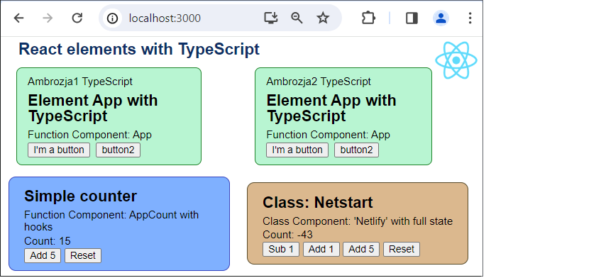

# Creating REACT elements in TypeScript

This page demonstrates creating simple REACT elements using TypeScript. Function_Component 
with hook mechanism and Class_Component with full_state are used.

- Project React with NPM tools, created by toolkit: create-react-app;
- This project requires instalation libraries by NPM tools, and compilation;
- Several .tsx files define elements with JSX syntax;
- index.tsx renders four elements adding external arguments to them;
- Npm instaled local libraries: react v18.2, react-dom v18.2, react-scripts v5.0 with babel-loader v8.3;
- Project written in Visual Studio Code;

.

## Details

The application is initiated by the toolchain [Create React App], which creates files and the application operating environment. The startup script [….\node_modules\react-scripts\scripts\start.js] starts a local web server, embeds the project files (html, css, js) and starts public/index.html along with the compiled tsx files.
